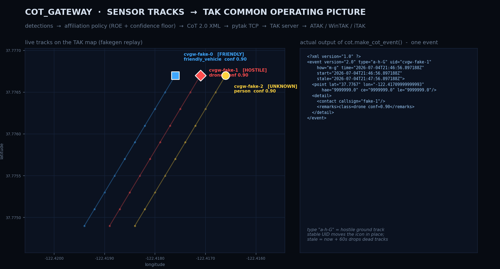

# cot_gateway

[](https://github.com/MichaelFowler1/cot_gateway/actions/workflows/tests.yml)

A sensor-to-COP gateway that converts object-detection tracks into
[Cursor-on-Target (CoT)](https://www.mitre.org/sites/default/files/pdf/09_4937.pdf)
events and publishes them to a TAK server (FreeTAKServer, TAK Server, etc.) in
real time. Connected TAK clients — WinTAK, ATAK, iTAK — see live, coloured
track icons that move and go stale automatically.

v1 ships a fake track generator so the full pipeline can be exercised end-to-end
before a real sensor is integrated.



*Real pipeline output: fakegen's track walk colored by `affiliation.py`'s policy
(left) and the literal CoT event `cot.py` serializes for the hostile drone track
(right). Regenerate with `python make_hero.py`.*

---

## Architecture

```
┌─────────────────┐     Track objects      ┌──────────────────┐
│  Sensor / CV    │ ──────────────────────▶ │   cot_gateway    │
│  pipeline       │  (track_id, lat, lon,   │                  │
│  (v2: real      │   class_name, conf)     │  1. affiliation  │
│   detector)     │                         │  2. CoT XML      │
│  (v1: fakegen)  │                         │  3. pytak TX     │
└─────────────────┘                         └────────┬─────────┘
                                                     │ TCP CoT
                                                     ▼
                                           ┌──────────────────┐
                                           │   TAK Server     │
                                           │ (FreeTAKServer,  │
                                           │  TAK Server OSS) │
                                           └────────┬─────────┘
                                                    │ CoT fan-out
                                              ┌─────┴──────┐
                                           WinTAK  ATAK  iTAK
```

### Stage 1 — Sensor / CV pipeline
Produces `Track` objects: a stable `track_id`, GPS position (`lat`, `lon`),
a `class_name` from the detector's label set, and a `confidence` score.
In v1 this is `FakeTrackWorker`, which advances three synthetic tracks along a
straight northeast vector to exercise the full pipeline without a camera.

### Stage 2 — cot_gateway
Three co-operating asyncio tasks (via [pytak](https://github.com/snstac/pytak)):

| Module | Role |
|---|---|
| `fakegen.py` | Emits `Track` objects into a shared `asyncio.Queue` on a fixed interval. Swap for the real detector in v2. |
| `worker.py` | `TrackQueueWorker` — pulls `Track` objects, calls `make_cot_event()`, hands CoT XML bytes to pytak's `tx_queue`. |
| `cot.py` | Serialises one `Track` to a CoT 2.0 XML `<event>` with stable UID, correct stale time, and MIL-STD-2525 type string. |
| `affiliation.py` | Maps `class_name` + `confidence` to CoT affiliation (`f`/`h`/`u`) with a confidence floor. |
| `config.py` | All tuning constants, 100 % environment-variable driven. |

### Stage 3 — TAK server
Receives CoT XML over a plaintext TCP connection (port 8087 on FreeTAKServer)
or SSL/TLS (port 8089). Stores events and fans them out to all connected clients.
`FTS_COMPAT` mode inserts a random inter-event sleep so burst traffic doesn't
overwhelm FreeTAKServer's ingestion pipeline.

### Stage 4 — TAK clients
WinTAK / ATAK / iTAK render each `Track` as a moving map icon coloured by
affiliation — blue (friendly), red (hostile), yellow/grey (unknown) — with a
callsign label and an automatic stale timer.

---

## Affiliation mapping

`affiliation.py` owns the policy that converts a detector label to a CoT
affiliation atom:

```python
CLASS_AFFILIATION = {
    "friendly_vehicle": "f",   # blue
    "soldier_friendly": "f",
    "person":           "u",   # yellow/grey
    "civilian":         "u",
    "vehicle":          "u",
    "drone":            "h",   # red
    "technical":        "h",
    "soldier_hostile":  "h",
}
```

Two design decisions worth noting:

1. **Confidence floor** — any detection below `CONFIDENCE_FLOOR` (default 0.40)
   is forced to unknown (`a-u-G`) regardless of class label. A shaky detection
   should never assert hostile.

2. **Unlisted classes default to unknown** — anything the detector emits that
   isn't in the table becomes `a-u-G`. Unknown is the safe fallback.

Tune this table to match your detector's actual label set and your ROE.

---

## Quick start

```bash
# 1. Install dependencies
pip install pytak>=6.0.0

# 2. Configure (copy and edit)
cp .env.example .env
# Set COT_URL to your TAK server, e.g. tcp://192.168.1.100:8087

# 3. Run
COT_URL=tcp://127.0.0.1:8087 FTS_COMPAT=1 python -m cot_gateway.main

# 4. Offline self-check (no TAK server needed)
python -m cot_gateway.selfcheck
```

---

## Configuration

All settings are environment variables. See `.env.example` for the full list
with descriptions. Key ones:

| Variable | Default | Description |
|---|---|---|
| `COT_URL` | `tcp://127.0.0.1:8087` | TAK server CoT endpoint |
| `FTS_COMPAT` | `1` | Enable pytak FTS throttle (`""` to disable) |
| `STALE_SECONDS` | `60` | Seconds before a track goes stale on the map |
| `CONFIDENCE_FLOOR` | `0.40` | Min confidence to assert non-unknown affiliation |
| `FAKE_INTERVAL` | `6` | Seconds between fake track position updates |
| `FAKE_TRACK_COUNT` | `3` | Number of fake tracks |
| `UID_PREFIX` | `cvgw` | Prefix for CoT UIDs |

---

## Engineering notes

### Why pytak?
[pytak](https://github.com/snstac/pytak) handles TCP/TLS connection management,
reconnect logic, the `FTS_COMPAT` throttle, and asyncio task scaffolding.
The gateway only needs to produce CoT XML bytes and put them on `tx_queue`.

### Stable UIDs
Each track gets a UID of the form `{UID_PREFIX}-{track_id}` (e.g. `cvgw-fake-0`).
Using the same UID on every update moves the existing map icon rather than
spawning a new one — critical for tracks that update continuously.

### Stale time
`stale` is set to `now + STALE_SECONDS`. As long as the gateway is running and
updates arrive faster than the stale window, icons stay solid. Stop the gateway
and the icons grey out after 60 s and then drop — which doubles as a live
connectivity indicator.

### FTS_COMPAT and queue depth
With `FTS_COMPAT=1`, pytak sleeps a random 0–5 s between events to avoid
overwhelming FreeTAKServer. At `FAKE_INTERVAL=6` with 3 tracks the average
production rate (0.5 events/s) roughly matches the average drain rate, so the
`tx_queue` oscillates rather than growing without bound. No events are dropped;
delivery is eventually consistent within the stale window.

### v1 → v2: replacing the fake generator
`FakeTrackWorker` is the only v1-specific code. Replace it with any coroutine
that calls `await track_in.put(Track(...))` — a frame-grabber, an RTSP decoder,
an HTTP inference endpoint. `TrackQueueWorker`, `cot.py`, and the TAK transport
layer require no changes.

### Next milestone: pixel-to-geo
The v2 detector will output pixel-space bounding boxes. Converting those to
`(lat, lon)` requires a geo-registration step: either a camera model + known
ground plane, or a homography estimated from GCP pairs visible in the scene.
That transform lives between the raw detector output and `Track` construction
and is the primary open engineering problem for v2.
